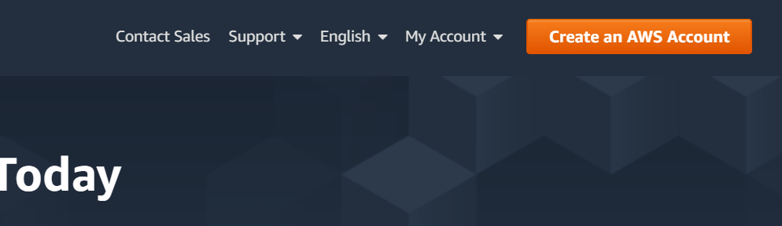
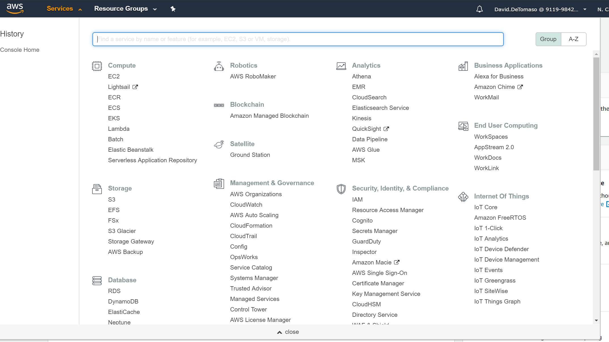
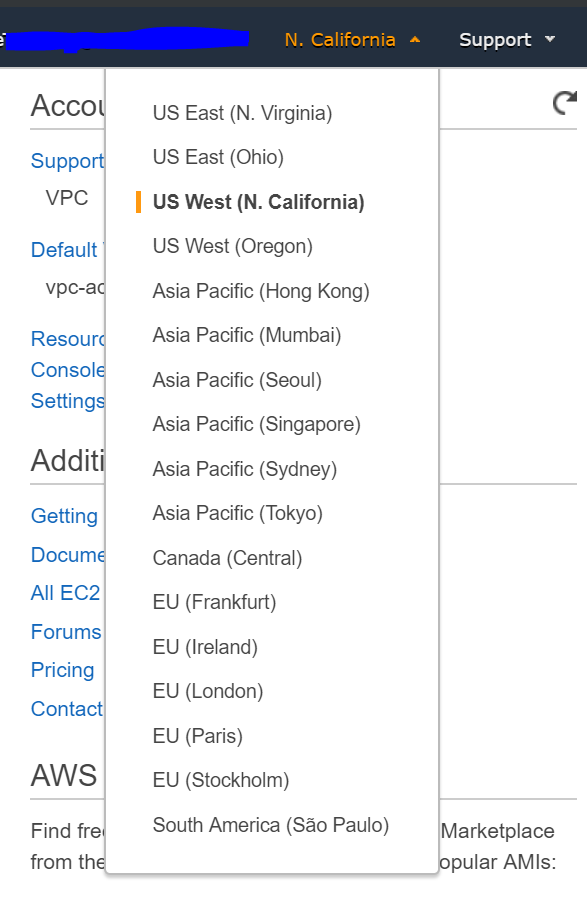
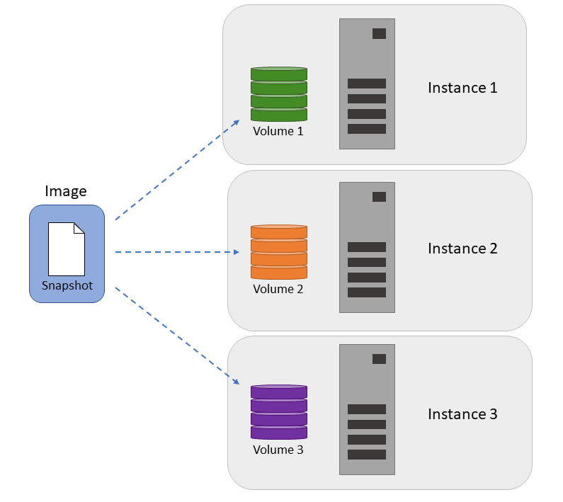
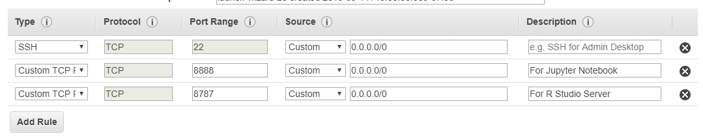
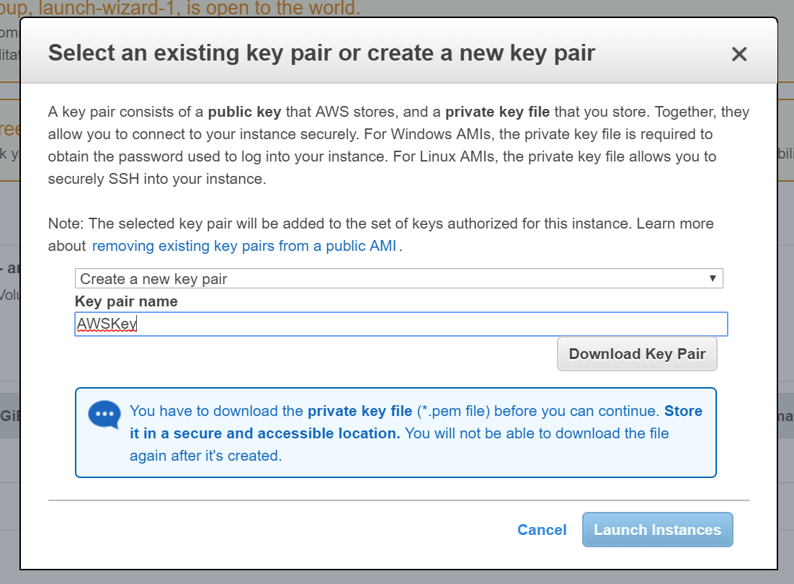
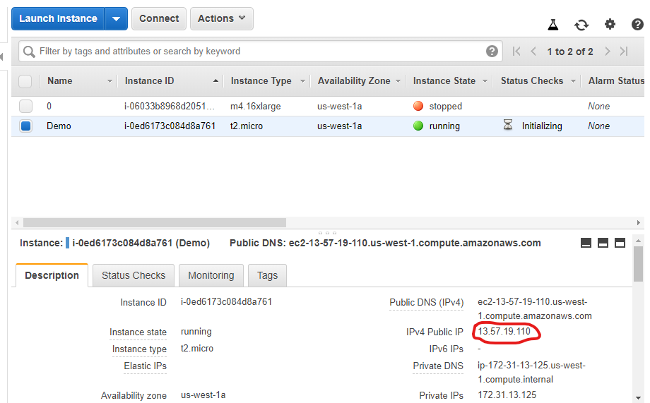
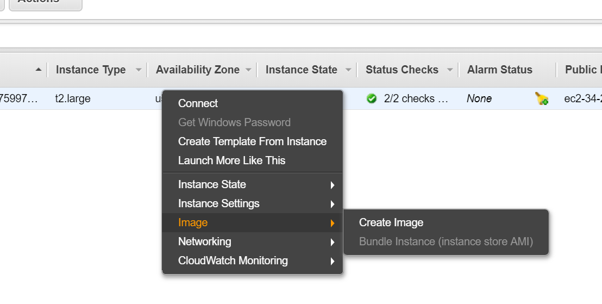

# Intro to AWS

**Why use AWS for a computational task?**

*There is no cloud - it's just someone else's computer.*

When we use a cloud service like AWS what we're actually doing is renting computers (processors and hard drives) in an Amazon datacenter somewhere.

This can be useful for several reasons:

1. You need to run something that will tie up your computer for a long time
2. Similarly, running multiple processor-intensive jobs at the same time
3. Compute tasks that require more RAM than you have on your laptop

**Cloud vs. a Local Cluster**

Compared to running on a local cluster (servers that are either run by the campus or by your research group), advantages of using AWS are:

1. Full control over the servers (sudo access, install whatever you want)
2. No need to wait for your jobs to run
3. No limits to how much computing power you need (except cost)

However, this comes with some drawbacks, namely:

1. (Again) Full control over the servers (you have to set up software yourself)
2. Costs - paying for compute, storage, and transfering data

So, in the end it'll be up to you to decide if leveraging AWS makes sense.

To help you make that decision, this guide will show you how AWS can be used, what is involved in setting up a compute job, and how to estimate costs.  Other resources are available at Berkeley (including the Savio cluster) and the Berkeley Research Computing offers [free consulting](http://research-it.berkeley.edu/services/cloud-computing-support) to help you decide what to use for your project. *(Note: I'm not affiliated with Berkeley Research Computing - I just found their service while researching for this talk).*


# AWS Basics

## Creating an AWS Account

The first step is to create an Amazon AWS account if you don't have one already.

Go to [https://aws.amazon.com](https://aws.amazon.com) and look for an option to create an account.



## Services

AWS is divided up into many services.




Most of these are enterprise-grade features that we don't have to worry about.  The two services you should know about are:

- **EC2**: "Elastic Compute Cloud", this is the service for renting compute time on the servers in Amazon's cloud
- **S3**: "Simple Storage Service", this service is for storing data

Everything we'll be doing here is within the **EC2** service.  

To get to the EC2 dashboard, after logging in:

- Click 'Services' on the toolbar in the upper-left
- Navigate to "EC2" under the "Compute" section

## Regions

Most things you work with in AWS will be scoped to a 'Region'.  Basically, Amazon has datacenters all over the world and you can choose which one you want to use for renting servers and storing data.

If you were running a large website, you'd want servers in many regions for speed and redundancy.

In our case, we just need to be aware that regions exist and how to select the 'current' region.  

Whenever you view a service, you are only showed the servers and data that are in the 'current' region.  You can see your region and switch it by looking at the dropdown in the upper-right corner (shown below).  

The choice of region isn't permanent in any sense - you can create servers in one region, then create some more in another region, and switch back and forth as you manage either group.  However, best to just pick a region close to you and remain in it.  If you ever sign on and all your servers seem to be missing - don't fret, you probably just have the wrong region selected.



## Instances, Volumes, Snapshots, and Images

To understand why we need to create an Image, it's important to understand the AWS terminology:

- **Instances**:  Each server (cloud computer) you provision (rent) is called an *instance*.
- **Volume**:  A *volume* is the storage that can be attached to an instance.  Think of it like plugging a hard drive into a computer.  Every instance needs at least one volume that contains its operating system.
- **Snapshot**:  A *snapshot* is a saved copy of a volume.  Imagine taking the entire contents of a hard drive and saving that to a file.
- **Image**: An *image* is a saved copy of a volume that can be used to launch an instance. Every **Image** really just consists of a **Snapshot** + some other meta-data

When you launch an instance, you select an image.  This image is copied onto the volume that is attached to the instance and then the instance is booted up.  The same image can be used to launch multiple volumes.



You don't have to create your own image - Amazon has many images with different operating systems already prepared.  However, if you use one of these, you'll have to install any extra software every time you create an instance.  Instead, we'll start with one of the base Amazon images, install some software, and then use it to create our own image.

Note: Images are also referred to as **AMI**s (Amazon Machine Images).

# Creating our first instance

- Navigate to EC2
- Select 'Instances' in the left menu-bar
- Click the 'Launch Instance' button in them middle


**Step 1: Choose AMI**
Here we choose the base AMI (image) for our instance.  Scroll until you see Ubuntu Server 18.04 and click 'Select' on the right.

**Step 2: Choose an Instance Type**
Next we choose an instance type.  Here we get to decide how powerful our machine is.  The caveat is that more powerful machines cost more per hour.  To see pricing, follow [this link](https://aws.amazon.com/ec2/pricing/on-demand/).  Since we are just installing software, let's choose a lower-end instance, the 't2.micro'.  Then click 'Next: Configure Instance Details' in the bottom right.

**Step 3: Configure Instance**
There are a lot of options on this page, but you can ignore most of them.  The one that is good to know about is the 'Request Spot Instances' option towards the top.  Don't click this now, but in the future, when running long jobs, you may want to select this option as spot instances can save a lot of money.  See the [appendix item on Spot Instances](#spot-instances) for info.  For now, just click 'Next' on the bottom right.

**Step 4: Add Storage**
On this page, you can set the storage space for your instance.  Let's set this to 50 GB to give ourselves some room.

**Step 5: Add Tags**
On this page you can add tags.  This is only useful if you have many servers and you want to organize them all using tags.  Click Next.

**Step 6: Configure Security Group**
On this page you can define which ports are open for your instance.  By default, 22 will be open for SSH.  There will be a warning that any IP address can access your instance.  If you'd like you can fix this by specifying your device's IP address on this page to restrict access to your machine, but this isn't required.  

We're going to open two more ports so that we can connect to a Jupyter notebook and R Studio Server on our instance.  Click "Add Rule" twice and set up the new rules as shown in the image:



Click 'Review and Launch' in the bottom right.

**Step 7: Review**
On this summary page click 'Launch'.  Here it asks you to create an encrypted key pair for SSH.  Once you make a key pair, you can use the same one for future instances.  Since this is our first instance, select 'Create a new key pair' from the first dropdown, then give your key pair a name, e.g. 'AWSKey', and click "Download Key Pair".  Make sure to save the Key Pair .pem file somewhere where you won't lose it.  You can only download the key pair once, but you can always create new key pairs in the future if you lose the file.  



Now click 'Launch Instances'.  On the next page, you can click 'View Instances' on the bottom to go back to the EC2 >> Instances page where you can see the status of your instance as it's booting.

## Logging into your Instance

On the EC2 >> Instances page, you can see your instance.  To connect to it via SSH, right-click the instance and click 'Connect'.  You will then be shown a popup with instructions on how to use your key pair to SSH into the instance.  In this case, I am using this command to connect:

```
ssh -i "~/AmazonKeys/AWSKey.pem" ubuntu@ec2-35-167-139-94.us-west-2.compute.amazonaws.com
```

Note that you must provide your own path to the key pair (AWSKey above) you created.  You'll also have to make sure it's permissions are '400' (AWS provides instructions on this too on the same popup).

## Setting up your software tools

Now you have a computer in the cloud!  Congratulations!  So what can we do with it?  Not much initially - first we'll have to install some software tools.

Here I'll show how to set up *Jupyter + Python* and *R + RStudio* on your instance.

### Jupyter + Python

The bare Ubuntu 18.04 instance we launched has Python 3.6 installed already, but we'll need to install 'pip' to download other packages:

```
sudo apt-get update
sudo apt-get install python3-pip
```

Now you can `pip install` any other python packages you want.  Let's install jupyter:

```
pip3 install jupyter
echo "export PATH=~/.local/bin:\$PATH" >> ~/.bashrc
source ~/.bashrc
```

Now we can run a jupyter notebook server like so:

```
jupyter notebook --ip 0.0.0.0 --port 8888
```

Here we specify the port that we opened earlier.  We also needed to specify the ip as '0.0.0.0' to make the notebook accessible remotely - we are 'remote' to this machine since it's in an Amazon datacenter somewhere.

Connecting to it is a little tricky - jupyter will show you one address which looks like this:

```
http://ip-172-31-13-125:8888/?token=9fa221c16f2a4453e59cf49b06c7c56ae30366346e166ad3
```

However, it gets the wrong IP address since the machine only knows it's internal IP address (behind Amazon's routing infrastructure).  We can replace this with the correct IP address by looking it up on the dashboard:



First copy the address that jupyter shows to the address bar in your web browser.  Then replace everything in-between the `//` and the first `:` with the Public IP.  So if your public IP was 54.193.76.55, you would wind up with:

```
http://54.193.76.55:8888/?token=9fa221c16f2a4453e59cf49b06c7c56ae30366346e166ad3
```

Congrats! Now you're up and running and can create a notebook.

### R + RStudio

We can follow the instructions [here](https://www.rstudio.com/products/rstudio/download-server/) to install R and RStudio Server.  RStudio "Server" is probably different than the RStudio you have on your laptop as it's designed to be accessed over the web.

First install R

```
sudo apt-get update
sudo apt-get install r-base
```

After running this you can run `R` and work with R in the command-line if you want.

Now install RStudio Server

```
sudo apt-get install gdebi-core
wget https://download2.rstudio.org/server/bionic/amd64/rstudio-server-1.2.1335-amd64.deb
sudo gdebi rstudio-server-1.2.1335-amd64.deb
```

(Note, if you are reading this many months after Sept 2019, these commands may be out of date and you should follow [this link](https://www.rstudio.com/products/rstudio/download-server/) for the updated commands)

Before launching the server, we need to set a password for our account.  To do this run the following command and choose a password.

```
sudo passwd ubuntu
```

Now we can start the server with:

```
rstudio-server start
```

We can navigate to the running server in our web browser.  First get the external IP of your instance:


Then navigate to `http://<instance-ip-address>:8787`

And finally, RStudio is at your fingertips!

# Creating an Amazon Machine Image

Now, you wouldn't want to do all of this setup every time you create a new instance.

Instead, you can create an Amazone Machine Image (AMI) from this instance.  This essentially creates a snapshot of everything we've set up, saves it, and allows us to create new instances that start with everything already installed.

On the EC2 Console (in your web browser), right click you instance and select "Create Image"



Give the image a name and description and hit 'Create Image'.

Now, on the left side of the dashboard, you can select 'AMIs' under the 'Images' heading and see the status of your image being created.  When the status goes from 'pending' to 'available', then you can launch new instances from this Image.

# Billing

It's important to be able to estimate how much running a job will cost.  AWS charges fall mainly in the following categories:

**1. Compute Time**

While an instance is running, you pay an hourly rate depending on how powerful that instance is.  For example, at the time this was written, these were the prices in the US West region:

- *t2.micro*: 1 CPU core, 1 GB RAM, **$0.014/hr**
- *t2.xlarge*: 4 CPU cores, 16 GB RAM, **$0.221/hr**
- *m5.16xlarge*: 64 CPU cores, 256 GB RAM, **$3.584/hr**

Note that prices are computed exactly, down to the second, and you only pay for an instance *while it is running*.  You can Stop an instance without Terminating it from the AWS Console - Instances page.  Stopping an instance is like shutting down your computer - everything on the hard drive will still be there when you power back up.  However, you still pay for the storage that the instance volume is using while it's stopped (next section).  You can stop an instance while logged in on the command line by using the `shutdown` command - and can include this at the end of a job script if you want the instance to stop itself as soon as the job is complete.

Pricing for EC2 instances can be [found here](https://aws.amazon.com/ec2/pricing/on-demand/)

**2. Instance Volumes**

Any volumes in-use are charged based on their size in GB.  At the time of this writing, that rate is $0.12 per GB-month in the US West region.  So, if you provision an instance with 100 GB of storage, and keep it around for a week (about 0.25 months), then total charge will be:

- 100 GB * 0.25 Months / ($0.12 GB-months) = $3.00

Current pricing for instance volumes can be [found here](https://aws.amazon.com/ebs/pricing/)

**3. Snapshots/AMIs**

Snapshots (saved copies of volumes) and AMIs are charged at a lower rate.  Currently about $0.055 per GB-month.  However, this could add up especially if you keep them around for a long time.  For this reason, it would be a good strategy to keep your snapshots small when you make an AMI - just keep enough space for you to put installed software.  Then, when you load that image, you can always add more space (for data, outputs, and temporary files).

Current pricing for instance volumes can be [found here](https://aws.amazon.com/ebs/pricing/) at the bottom (see "Amazon EBS Snapshots to Amazon S3")

**4. Data Transfer**

Lastly, there are charges for transferring data OUT of EC2 (transferring data IN is free).  Right now it's about $0.09 / GB for outbound transfers (details at bottom of [this page](https://aws.amazon.com/ec2/pricing/on-demand/)).  If your compute job processes lots of data, but the results are small in file size (e.g., aligning reads to produce a gene-count matrix) then this cost will be insignificant.  But, if your job results in the creation of lots of data - all of which you need to download when finished, it's important to plan for this charge.

# Example:  Aligning RNA-seq data

To help clarify things, here's an example computational job you might want to run in the cloud - we're going to align some RNA-seq data with the STAR aligner.

First, I've already installed the STAR aligner on our example image.  I did this by following the instructions [on their Github](https://github.com/alexdobin/STAR), namely running:

```
# Get latest STAR source from releases
wget https://github.com/alexdobin/STAR/archive/2.7.2b.tar.gz
tar -xzf 2.7.2b.tar.gz
cd STAR-2.7.2b

# Compile
cd STAR/source
make STAR
```

I've also uploaded a STAR-compiled reference of the human genome.

Now, we'll launch an instance using the image we've created.  STAR requires at least 32 GB so we can't use our t2.micro free-tier machine.

Go to "Instances", and instead of selecting Ubuntu as an AMI, click the "My AMIs" tab on the left and select your new Image.

For the machine, select the m5a.2xlarge instance type with 32 GB of RAM (current rate is $0.38/hr).

And everything else we can set up as before (except no need to open the ports for Jupyter or RStudio). Launch the instance.

Now, let's assume we have the reads (stored in a .fastq file) on our computer.  We're going to upload the fastq files to our instance using `scp` in a similar way that we've been using `ssh`:

```
# These files have been trimmed down to only 250k reads for the demo

scp -i "amazonkey.pem" SRR1721276_250k_1.fastq.gz ubuntu@ec2-54-193-56-170.us-west-1.compute.amazonaws.com:~

scp -i "amazonkey.pem" SRR1721276_250k_1.fastq.gz ubuntu@ec2-54-193-56-170.us-west-1.compute.amazonaws.com:~
```

And now we can run our alignment:

```
nohup STAR --runMode alignReads --runThreadN 8 --genomeDir ~/References/hg38_STAR --readFilesIn SRR1721276_250k_1.fastq.gz SRR1721276_250k_2.fastq.gz --outFileNamePrefix alignedOut &
```

Two things are important in this command:

1. `nohup` at the start
2. Ends with `&`

The `nohup` is used on the command so that we can log off our instance without stopping our STAR job.  Similarly the `&` at the end runs the job in the background so that we can continue using the terminal.  All the job output messages (that would normally be printed to the terminal) are logged to a file `nohup.out`.

If you want your instance to shut down automatically as soon as the job is done (and save the compute costs), you could instead put the following into a file, let's call it `job.sh`:

```
STAR --runMode alignReads --runThreadN 8 --genomeDir ~/References/hg38_STAR --readFilesIn SRR1721276_250k_1.fastq.gz SRR1721276_250k_2.fastq.gz --outFileNamePrefix alignedOut

sudo shutdown
```

And then run:

```
nohup bash job.sh &
```

Note here the `nohup` and the `&` are both outside the file.

Later, you can start your instance back up, log into it, and download the results - again using `scp` with something like:

```
scp -i "amazonkey.pem" ubuntu@ec2-54-193-56-170.us-west-1.compute.amazonaws.com:~/alignedOut/outputfile.sam .
```


# Appendix:

## Command Line Interface (CLI)

AWS has an extensive command-line interface documented [here](https://aws.amazon.com/cli/).  Basically, everything we did on their web portal, you could do from the command line.  This can be useful if you want to write scripts that involve AWS.  Also, you can use the command line tools from within instances you create.  For an example of how this could be useful - imagine you were managing many different RNA-seq references.  Instead of putting them on your images, you can put them in Amazon S3 - which is kind of like a giant web hard drive, and then access them from your image.  You'd use commands like:

```
# Upload the reference into s3
aws s3 cp hg38_STAR s3::/references/hg38_STAR --recursive

# Then in you instance, run this to download it
aws s3 cp s3::/references/hg38_STAR hg38_STAR --recursive
```
There's no charge for data transfers within the same region, though you would still pay for the storage of the reference (about half the cost per GB of volume storage).

## AWS Batch

## Raising utilization limit for instance

You *may* get an error launching the instance - something about your utilization limit for that instance being exceeded.  This happens because for some instance types, Amazon automatically sets a limit of 0 intances on new AWS accounts.  I believe this is done for security purposes (so that someone getting your login key can't just spin up 1000 instances to mine bitcoin at your expense).  If you run into this error, it's fairly easy to request a limit increase in the support center.  I've found that usually Amazon responds to these requests in a few hours.

Click 'Support' in the upper-right corner and select 'Suppert Center' from the dropdown.

Create a support case and select 'Service limit increase'.  Here select the Region you are using and the Instance tpe (e.g. c5.24xlarge) and request to raise the instance limit to 1.

## Spot Instances

Spot instances are available for much cheaper (often around 1/3 the cost, [pricing here](https://aws.amazon.com/ec2/spot/pricing/)) but they come with two caveats.  First, the price of spot instances can increase with demand.  When you request spot instances you specify what you are willing to pay and if the price goes above that, then your instances will be halted.  However, if you just bid the current on-demand price (the default if you leave the bid price blank), then this is not likely to happen.  The second caveat is that you can't Stop and Start a spot instance.  With on-demand instances you can 'Stop' the instance, essentially pausing it indefinitely.  You won't be charged for compute costs while it is stopped and then you can start it again at a later time.  With a spot instance, once you stop it you can't start it again, so you must download the results of a computation before stopping the instance.  Alternately, you can attach an extra storage volume to the instance and save your results on that volume, then mount that with another instance later to get a similar kind of behavior - just with a bit more work.
